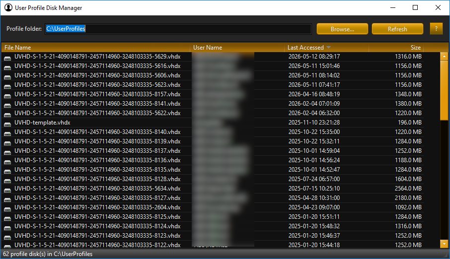

# User Profile Disk Manager

A small Windows utility for browsing, inspecting, and cleaning up **Remote Desktop Services
User Profile Disks** (`.vhdx` / `.vhd`). Point it at the folder where your User Profile
Disks live and it lists every disk with the user it belongs to, when it was last accessed,
and how big it is. Double-click a disk to mount it, drill into its contents in a built-in
Explorer view, then unmount it or delete it for good.

Written in Delphi 13.1 Florence using the VCL Framework.

## Features

- **Folder scan** — lists all `*.vhdx` and `*.vhd` files in a chosen folder.
- **Automatic user resolution** — RDS User Profile Disks are named `UVHD-<SID>.vhdx`.
  The app strips the `UVHD-` prefix and resolves the SID to a friendly account name via
  `LookupAccountSid`. The RDS template disk (`UVHD-template`) is labelled accordingly, and
  unrecognized names fall back to the raw file name.
- **Sortable grid** — file name, resolved user name, last-accessed time, and size, each with
  click-to-sort columns and real Windows shell icons.
- **Mount & explore** — double-clicking a disk attaches it through the Windows Virtual Disk
  Service API (`virtdisk.dll`), waits for Windows to assign a drive letter, and opens a
  two-pane Explorer view (folder tree + file list) for drill-down. Files open with their
  associated application; folders are navigable.
- **Unmount or delete** — from the Explorer view you can detach the disk or permanently
  delete the underlying `.vhdx`/`.vhd` file (with confirmation). The disk is always detached
  cleanly before the file is removed.
- **Remembers your folder** — the last-used profile folder is saved to the registry and
  restored on the next launch.

## Requirements

- Windows (uses the Virtual Disk Service API and Windows shell APIs).
- **Administrator privileges.** Attaching a virtual disk requires elevation, so the
  application manifest requests `requireAdministrator` — Windows will prompt for elevation
  on launch.

## Dependencies

This project depends on the following libraries, which must be installed and on Delphi's
library path before building:

- **[Virtual TreeView](https://github.com/JAM-Software/Virtual-TreeView)** — the
  `TVirtualStringTree` control used for the profile grid and the Explorer's folder/file
  panes.
- **`TccRegistryLayoutSaver`** from **[ccLib](https://github.com/corneliusdavid/ccLib)** —
  used to persist and restore the last-used profile folder in the registry.

## Project layout

| Unit | Responsibility |
|------|----------------|
| `UserProfileMgr.dpr` | Program entry point; VCL styling and main form startup. |
| `uMain.pas` | Main window: folder picker, profile grid, mount/open/delete orchestration. |
| `uProfileScan.pas` | Scans a folder for profile disks and resolves each file's SID to a user. |
| `uVHDX.pas` | Thin wrapper over `virtdisk.dll` for mounting/unmounting virtual disks. |
| `uExplorer.pas` | Two-pane Explorer view for a mounted disk; returns the chosen action. |
| `uShellUtils.pas` | Shell helpers: system icon image list, file enumeration, type names. |

## License

Licensed under the Apache License 2.0 — see [LICENSE](LICENSE).

## Screenshot

